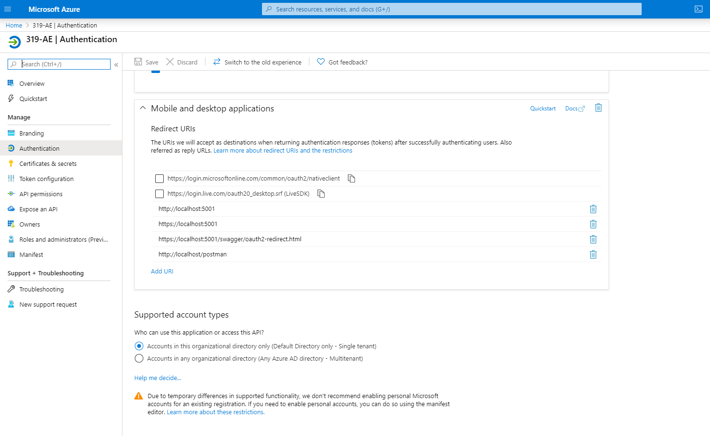
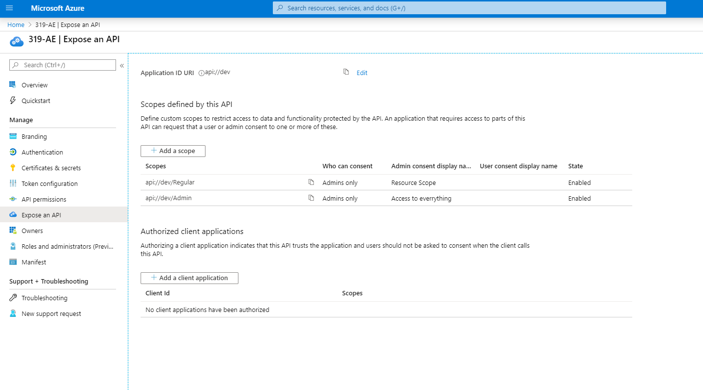
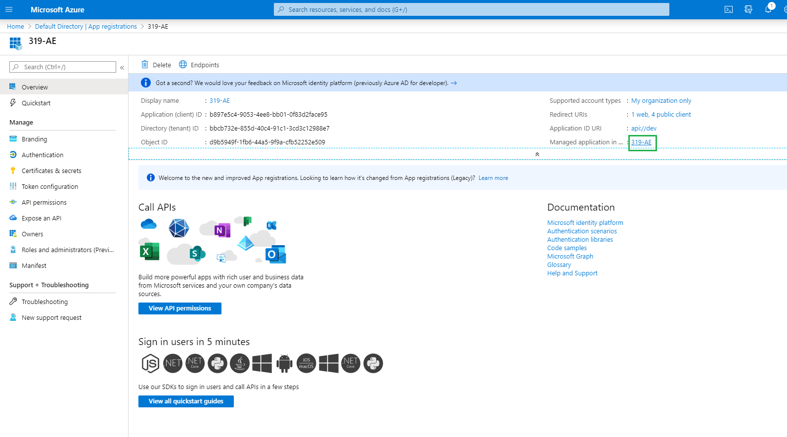
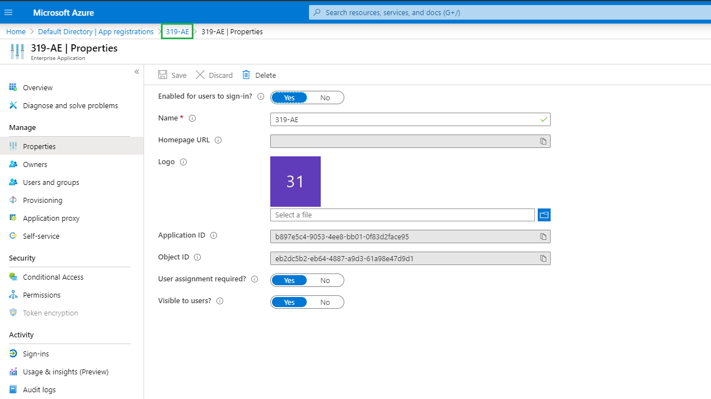
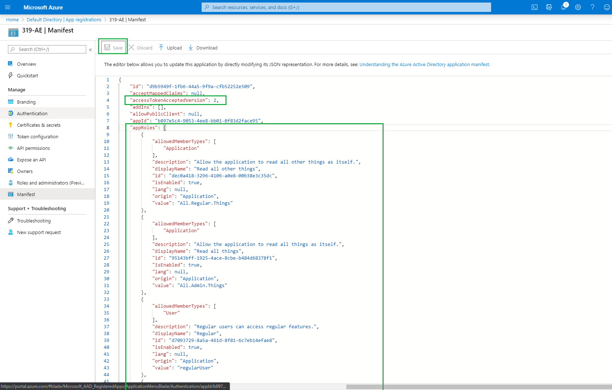
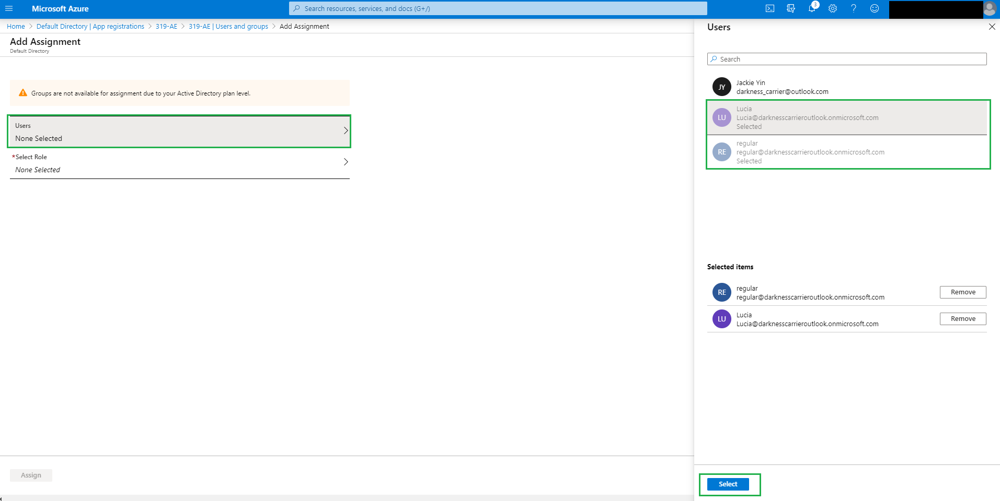
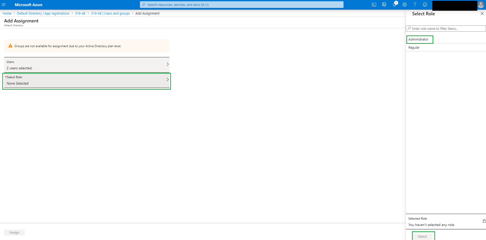
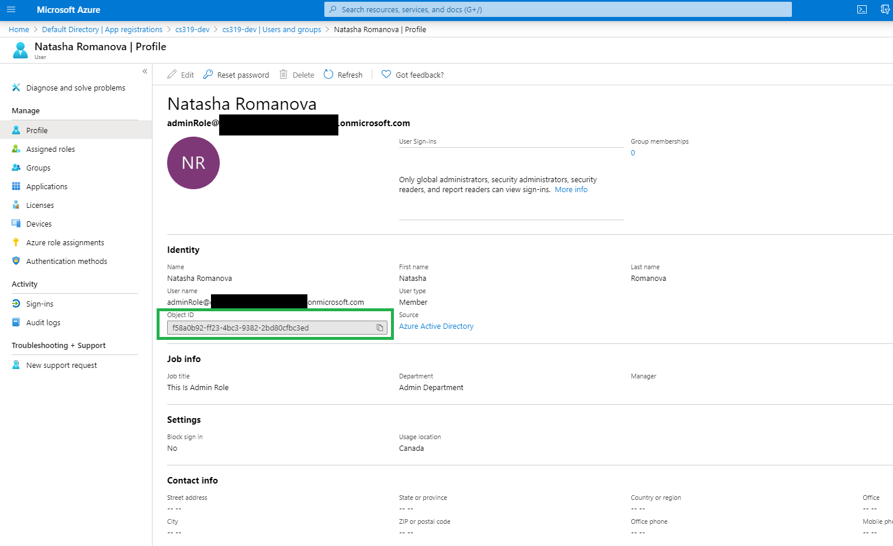
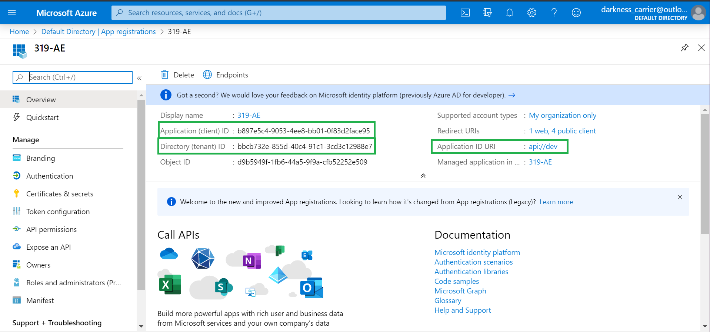

# UBC-2020 Blueprint

This document is a project blueprint for the Associated Engineering Resource Management System project. The purpose of the doucment is to provide the teams with a starting point, and some guidance on the project structure.

## Prerequisites

You'll need the following applications installed on your machine before getting started:

| Application                                                                          | Version                     | Usage            |
| ------------------------------------------------------------------------------------ | --------------------------- | ---------------- |
| [git](https://git-scm.com/downloads)                                                 | Any                         | for cloning repo |
| [Visual Studio](https://visualstudio.microsoft.com/downloads/)                       | Community Edition or Latest | for service      |
| [SQL Server Express](https://www.microsoft.com/en-ca/download/details.aspx?id=55994) | 14.0.1000.169               | for database     |
| [Node.js/NPM](https://www.npmjs.com/get-npm)                                         | Latest LTS Version          | for client       |

| Account                                                                     | Usage              |
| --------------------------------------------------------------------------- | ------------------ |
| [Microsoft Azure](https://azure.microsoft.com/en-ca/features/azure-portal/) | for authentication |

## Set-up and Configuration Instructions

1. Clone the repo [here](https://dev.azure.com/associated/AE-UBC/_git/cpsc319-2020-winter-blueprint)

2. After the repo is cloned, navigate to the ../cpsc319-2020-winter-blueprint directory

   ```bash
   cd cpsc319-2020-winter-blueprint
   ```

### Authentication

#### Registering a new application on Azure

1. Log into [Microsoft Azure](https://azure.microsoft.com/en-ca/features/azure-portal/)
2. Navigate to ['portal'](https://portal.azure.com/#home)
3. Click on 'Azure Active Directory', click on 'App registrations', click 'New Registration' to create a new application
4. Give the application a name, under 'Supported account types' select 'Accounts in this organizational directory only (... only - Single tenant), under 'Platform configuration (Optional) select 'Client Application (Web, iOS, Android, Desktop+Devices)', then hit 'Register'
5. You should be redirected to the 'Authentication' page of the app your just registered, if not then navigate to the 'Authentication' page of your app
6. Under 'Platform configurations' click on 'Add a platform' >> Click 'Web' >> under 'Redirect URIs' in the 'Configure Web' flyout, enter [https://localhost:5001](https://localhost:5001) (For development) >> hit 'Configure' to save changes
8. After saving there will be a Web dropdown under 'Platform configurations', expand the dropdown and click 'Add URI', and add the following:
	- For Development: [http://localhost:3000](http://localhost:3000)
	- For Production: https://{actual-domain} 
	- and hit the 'Save' button at the top
9. Click on 'Add a platform' again, and then click on 'Mobile and desktop applications'
10. Type 'https://localhost:5001' into the text field and click 'Configure'
11. (Optional: To enable authentication for swagger): Click 'Add URI' under 'Mobile and desktop applications' section and add 'https://localhost:5001/swagger/oauth20redirect.html'
12. (Optional: To enable authentication for postman): Click 'Add URI' under 'Mobile and desktop applications' section and add 'https://localhost/postman'
13. (Optional: To enable authentication for swagger for live site): Click 'Add URI' under 'Mobile and desktop applications' section and add 'https://{actual-domain}/swagger/oauth20redirect.html'
14. Click 'Save' button at the top


##### Adding Scopes / Roles for Authentication
14. In the navigation bar on the left, click 'Expose API'
15. Add an Application ID URI (ex. 'api://dev') by clicking edit, typing in the text field, and saving
15. Click 'Add a scope' >> In Scope Name field, enter 'Regular' >> Fill in required fields of 'Admin consent display name' and 'Admin consent description' with some values respectively (ex. 'Resource Scope', 'Limited Access' respectively) and click 'Add Scope'
16. Click 'Add a scope' >> In Scope Name field, enter 'Admin' >> Fill in required fields of 'Admin consent display name' and 'Admin consent description' with some values respectively (ex. 'Admin Scope', 'Access to Everything') >> click 'Add Scope'
- NOTE: The words 'Regular' and 'Admin' will need to be consistent with both server-code and client-code


##### Configuring Users with Different Authorizations
1. From [Microsoft Azure](https://azure.microsoft.com/en-ca/features/azure-portal/)
2. Navigate to ['portal'](https://portal.azure.com/#home)
3. Click on 'Azure Active Directory', click on 'App registrations'
4. Click on your app name
5. Click on app name in 'Managed appplication in...' (see image below)

6. In left-hand navigation bar, click 'Properties'
7. Set 'User assignment required?' to 'Yes' 
8. Click 'Save' button above
9. In the navigation links (see image below), click '<< App Name >>' 

10. In navigation bar on left-hand side, click 'Manifest'
11. Change value of "accessTokenAcceptedVersion" to `2`
12. Change empty array of "appRoles" to 
```json
[
		{
			"allowedMemberTypes": [
				"Application"
			],
			"description": "Allow the application to read all other things as itself.",
			"displayName": "Read all other things",
			"id": "dec0a418-3296-4106-a0e8-00b38e3c35dc",
			"isEnabled": true,
			"lang": null,
			"origin": "Application",
			"value": "All.Regular.Things"
		},
		{
			"allowedMemberTypes": [
				"Application"
			],
			"description": "Allow the application to read all things as itself.",
			"displayName": "Read all things",
			"id": "95143bff-1925-4ace-8cbe-b484d68378f1",
			"isEnabled": true,
			"lang": null,
			"origin": "Application",
			"value": "All.Admin.Things"
		},
		{
			"allowedMemberTypes": [
				"User"
			],
			"description": "Regular users can access regular features.",
			"displayName": "Regular",
			"id": "d7093729-8a5a-461d-8f81-6c7eb14efae8",
			"isEnabled": true,
			"lang": null,
			"origin": "Application",
			"value": "regularUser"
		},
		{
			"allowedMemberTypes": [
				"User"
			],
			"description": "Administrators can access advanced features.",
			"displayName": "Administrator",
			"id": "179c1dc0-4801-46f3-bc0d-35f059da1415",
			"isEnabled": true,
			"lang": null,
			"origin": "Application",
			"value": "adminUser"
		}
	]
   ```

13. Click 'Save' button above

14. In the navigation links, click 'Default Directory | App registrations'
15. (Optional - To add more users, do steps 15 - 16): In navigation bar, click 'Users'
16. (optional) Click 'New user' >> fill in required fields and click 'Create' button at the bottom
17. In navigation link, click 'Default Directory' 
18. In navigation bar, click 'App registrations' >> Click app name
19. Click app name next to 'Managed application in...'
20. In navigation bar, click 'Users and groups'
21. Click 'Add user' 
22. Click 'Users' >> Click 'Users: None Selected' >> Click on the user(s) that you would like to assign a role to >> Click 'Select'

23. Click 'Select Role' >> Click on a role that you would like to assign to the users (eg. either 'Administrator' or 'Regular) >> Click 'Select'


### Configure Database and Service

#### Create local database

1. Open SQL Server Management Studio (SSMS)
2. Create a new local database instance (Right-click Databases>New Database...>give Database a name (eg. ResourceMGMT))

#### Prepare the database and populate

1. Navigate to the ../src/svc-dotnetcore3 directory

   ```bash
   cd src/svc-dotnetcore3
   ```

2. Double click on svc-dotnetcore.sln to open up the Visual Studio solution, in solution explorer you will find three projects (Database, Tests, Web.API)
3. Right click on the Database project and select 'Publish...'
4. In the Publish Database window select 'Edit...'
5. Select the 'Browse' tab and enter the server name (same as the one in SSMS), using the dropdown menu, select the database instance in (SMSS), click on 'Test Connection' and ensure the connection is successful, click 'OK' once the test connection is successful
6. In the Publish Database window click on 'Advanced...'
7. In the 'General' tab under the 'Deployment Behavior' section, 'Uncheck Block incremental deployment if data loss might occur' and click 'OK' to confirm settings
8. In the Publish Database window, click on 'Save Profile As...', enter the File name as Database.DEV.publish.xml, ensure the file path pointing at the Database project in Visual Studios before hitting 'Save'
9. In the Publish Database window click 'Publish'
10. In the Database project open up the seed.sql file (scripts>seed.sql) and copy the SQL statements
11. Navigate to (SMSS) and create a 'New Query' in your database instance
12. Paste the SQL statments from the seed.sql and execute the statements to populate the database; some duplicated usernames may not copy over, this is fine
13. If the users created in Azure was not seeded into the database, seed them in: 
```sql
Insert into Users values (N'<Users Object ID in Azure>', N'<FirstName>', N'<LastName>', N'<User name>', <Database Location Id of Users location>, 0, <1 if admin, 0 if not admin>, <1 if is a manager, 0 if is not a manager>);
```

Note: User's Object ID can be found at:
- 'Default Directory' of Microsoft Azure Portal >> 'App Registration' >> '< App Name >' >> < App Name > next to 'Managed application in...' >> 'Users and groups' >> '< User's Name>'

Example: 
```sql
Insert into Users values (N'f58a0b92-ff23-4bc3-9382-2bd80cfbc3ed',N'Natasha', N'Romanova', N'ADMIN-OVERPOWER', 9, 1000, 1, 0);
```


#### Configure the service

1. In the Web.API project, create a copy of appsettings.json and name it appsettings.Development.json
2. Edit appsettings.Development.json, in the ConnectionString replace the Data Source with the server name (same server name in SMSS), replace the Initial Catalog with the database name (same as database name in SMSS), and add [http://localhost:3000](http://localhost:3000) to AllowedOrigins, also populate the AzureAd Tenant and ClientId with the ID's from the app registration on azure, and save the changes to the file

   ```json
   "ConnectionString": "Data Source=server_name; Initial Catalog=database_name; Integrated Security=True;"
   "AllowedOrigins": "http://localhost:3000",
   "AzureAd": {
     "Instance": "https://login.microsoftonline.com/",
     "TenantId": "<Directory (tenant) Id>",
     "ClientId": "<Application (client) Id>"
   }
   ```

3. Run the Web.API project (default might be IIS Express in the debugging options), click on the (green play button button dropdown and change to Web.API); to see more detail about the port settings go to the Web.API project and go to properties > launchSettings.json. Feel free to make any changes to the ports but make sure the changes are echoed in the Azure Active Directory ports as well.


### Configure the Client

1. Navigate to ../cpsc319-2020-winter-blueprint/src/ui-react-client
2. Run npm install

   ```bash
   npm install
   ```

3. Open up ../ui-react-client using a text editor or IDE of your choice
4. Add an .env file to the root ui-react-client and paste in the following (fill in the application and directory id from your app in azure, fill in the production service url before pushing to production)

   ```txt
   REACT_APP_UI_ROOT = http://localhost:3000/
   REACT_APP_SVC_ROOT = https://localhost:5001/
   REACT_APP_CLIENT_ID = <Application (Client) Id>
   REACT_APP_TENANT_ID = <Directory (Tenant) Id>
   REACT_APP_API_ID = <Application ID URI>
   ```

   See image below as example:
   

6. Run npm start to run the client application

   ```bash
   npm start
   ```

   You should be prompted with a login page, and after logging in you should have access to the application. The Users, Projects, and Locations navigation should be giving a failedError: Network Error if your service isn't running

### Run Full Stack (service and client)

1. Run the service Web.API project in Visual Studio
2. Run the front end, navigate to localhost:3000 if browser does not open page up on its own

   ```bash
   npm start
   ```

3. Will be prompted with a microsoft login / permissions page, enter the necessary login credentials (if you're already logged in then it will take you directly to the main page of the application)
4. Click on the [http://localhost:3000/users](http://localhost:3000/users), [http://localhost:3000/projects](http://localhost:3000/projects), and [http://localhost:3000/locations](http://localhost:3000/locations) navigation links and you should be getting data back on the pages

- note: the projects and users endpoints may take longer to load

### Tests

#### Service

1. Navigate to the 'Test Explorer'
2. Select test(s) to run

#### Client

1. Type npm test to run all tests

#### Deploying Live Site

1. Ensure that all the setup necessary for live sites (see above) has been completed
2. For rest of the steps see [DeploymentSetup](docs/DeploymentSetup.pdf)